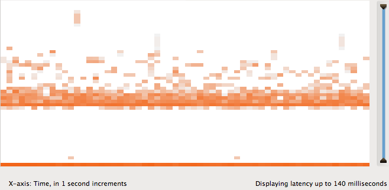

# Cloud Analytics

Cloud Analytics provides deep observability for systems and applications in a
SmartDataCenter cloud.  The CA service enables operators and end users to
dynamically instrument systems in the cloud to collect performance data that can
be visualized in real-time through the operator or customer portals or analyzed
using the API.  This data can be collected and saved indefinitely for capacity
planning and other historical analysis.

# Overview

## CA Service

Operators and end users interface with the Cloud Analytics service either
directly through the CA HTTP REST API (part of the Cloud API) or through a
portal which itself uses the REST API.  The CA API allows users to:

* list available metrics and fields
* create and delete instrumentations
* retrieve values for instrumentations

These concepts will are explained under "Building blocks" below.

For simplicity, this documentation assumes that parameters, payloads, and return
values are all specified using JSON, though the API may support other formats.
The rest of the examples in this document will use "curl" to make requests and
JSON for responses.

## Building blocks: metrics, instrumentations, and fields

A **metric** is any quantity that can be instrumented using CA.  For examples:

* Disk I/O operations
* Kernel thread executions
* TCP connections established
* MySQL queries
* HTTP server operations
* System load average

Each metric also defines what **fields** are available when data is collected.
These fields can be used to filter or decompose data.  For example, the Disk I/O
operations metric provides fields "hostname" (for the current server's
hostname) and "disk" (for the name of the disk actually performing an
operation).

You can list the available metrics using the API:

	# curl $casvc/ca
	{
		"metrics": [ {
			"module": "disk",
			"stat": "physio_ops",
			"label": "I/O operations",
			"interval": "interval",
			"fields": [ "hostname", "disk", "optype", "latency",
			    "size", "offset" ],
			"unit": "operations"
		}, ...  ], ...
	}

The "module" and "stat" properties identify the metric.  The "/ca" resource
lists a lot of information about the CA service.  For details and information
about the other properties of each "metric" object, see the API documentation.

When you want to actually gather data for a metric, you create an
**instrumentation**.  The instrumentation specifies:

* which metric to collect
* an optional **filter** based on the metric's fields (e.g., only collect data
  from certain hosts, or for zones owned by a particular customer)
* an optional decomposition based on the metric's fields (e.g., break down the
  results by server hostname)
* how frequently to aggregate data (e.g., every second, every hour, etc.)
* how much data to keep (e.g., 10 minutes' worth, 6 months' worth, etc.)
* other configuration options

Continuing the above example, if the system provides the metric "Disk I/O
operations" with fields "hostname" and "disk", an example instrumentation might
specify:

* to collect data for the "Disk I/O operations" metric (the *metric*)
* to collect the data once per second and store it for 10 minutes
* to only collect data from host "hostA" (a *predicate*)
* to break out the results by disk name (a *decomposition*)

When this instrumentation is created, the system instruments the software on
hostA to start gathering the requested information and report it to the CA
service.  You can then retrieve its value for any time in the last 10 minutes
and get back a list of the number of disk I/O operations completed during that
second on server "hostA" broken down by disk name.

Here's an example of creating such an instrumentation.  For syntax details, see
the documentation:

	# cat request.json 
	{
		"module": "disk",
		"stat": "physio_ops"
		"granularity": 1,
		"retention-time": 600,
		"predicate": { "eq": [ "hostname", "headnode" },
		"decomposition": [ "disk" ]
	}

	# curl -X POST $casvc/ca/instrumentations -Trequest.json \
	    -H 'Content-type: application/json'
	{
		"module": "disk",
		"stat": "physio_ops",
		"predicate": { "eq": [ "hostname", "headnode" ] },
		"decomposition": [ "disk" ],
		"value-dimension": 2,
		"value-arity": "discrete-decomposition",
		"enabled": true,
		"retention-time": 600,
		"idle-max": 3600,
		"transformations": {},
		"nsources": 1,
		"granularity": 1,
		"persist-data": false,
		"crtime": 1308862234757,
		"value-scope": "interval",
		"uri": "/ca/instrumentations/16",
		"id": "16",
		"uris": [ {
		    "uri": "/ca/instrumentations/16/value/raw",
		    "name": "value_raw"
		} ],
		"warnings": []
	}

When we create this instrumentation, the system dynamically instruments the
relevant software and starts gathering data.  The data is made available
immediately in real-time.  To get the data for a particular point in time, you
retrieve the **value** of the instrumentation for that time:

	# curl $casvc/ca/instrumentations/16/value/raw
	{
		"value": {
		  "sd0": 1249,
		  "cmdk0": 0
		},
		"transformations": {},
		"start_time": 1308862501,
		"duration": 1,
		"nsources": 1,
		"minreporting": 1,
		"requested_start_time": 1308862501,
		"requested_duration": 1,
		"requested_end_time": 1308862502
	}	

To summarize: *metrics* define what data the system is capable of reporting.
*Fields* enhance the raw numbers with additional metadata about each event that
can be used for filtering and decomposition.  *Instrumentations* specify which
metrics to actually collect, what additional information to collect from each
metric, and how to store that data.  When you want to retrieve that data, you
query the service for the *value* of the instrumentation.

## Values and visualizations

We showed above how fields can be used to decompose results.  Let's look at that
in more detail.  We'll continue using the "Disk I/O operations" metric with
fields "hostname", and "disk".

### Scalar values

Suppose we create an instrumentation with no filter and no decomposition.  Then
the value of the instrumentation for a particular time interval might look
something like this (omitting several unrelated properties):

	{
		start_time: 1308789361,
		duration: 1,
		value: 573
	}

In this case, `start_time` denotes the start of the time interval in Unix time,
`duration` denotes the length of the interval, and `value` denotes the actual
value, which is 573.  This means that 573 disk I/O operations completed on all
systems in the cloud between times 1308789361 and 1308789362.

### Discrete decompositions

Now suppose we create a new instrumentation with a decomposition by hostname.
Then the raw value might look something like this:

	{
		start_time: 1308789361,
		duration: 1,
		value: {
			host1: 152,
			host2: 49,
			host3: 287,
			host4: 5
		}
	}

We call the decomposition by "hostname" a **discrete decomposition** because the
possible values of hostname ("host1", "host2", ...) are not numbers.

Similarly, we could examine the disk operations specific to a particular host
(say "host1") and decompose that by disk name.  We could create a new
instrumentation for that and the value might look something like this:

	{
		start_time: 1308789361,
		duration: 1,
		value: {
			disk1: 16,
			disk2: 57,
			disk3: 12
		}
	}

### Numeric decompositions

It's also useful to decompose some metrics by numeric fields.  For example, you
might want to view disk I/O operations decomposed by latency, which is how long
the operation took.  Rather than breaking out every possible nanosecond value of
latency, the resulting value shows the *distribution*, grouping nearby latencies
into buckets and showing the number of disk I/O operations that fell into each
bucket.  The result looks like this:

	{
		"value": [
			[ [ 53000, 53999 ], 4 ],
			[ [ 54000, 54999 ], 4 ],
			[ [ 55000, 55999 ], 7 ],
			...
			[ [ 810000, 819999 ], 1 ]
		],
		"transformations": {},
		"start_time": 1308863061,
		"duration": 1,
		"nsources": 1,
		"minreporting": 1,
		"requested_start_time": 1308863061,
		"requested_duration": 1,
		"requested_end_time": 1308863062
	}

That data indicates that at time 1308863061, the system completed:

* 4 requests with latency between 53 and 54 microseconds,
* 4 requests with latency between 54 and 55 microseconds,
* 7 requests between 55 and 56 microseconds, and so on, and finally
* 1 request with latency between 810 and 820 microseconds.

This type of instrumentation is called a **numeric decomposition**.

### Combining decompositions

It's possible to combine a single discrete and numeric decomposition to produce 
an object mapping discrete key to numeric distribution, whose value looks like
this:

	{
		"value": {
			"sd0": [
				[ [ 110000, 119999 ], 1 ],
				[ [ 120000, 129999 ], 1 ],
				...
				[ [ 420000, 429999 ], 1 ],
				[ [ 25000000, 25999999 ], 1 ]
			]
		},
		"transformations": {},
		"start_time": 1308863799,
		"duration": 1,
		"nsources": 1,
		"minreporting": 1,
		"requested_start_time": 1308863799,
		"requested_duration": 1,
		"requested_end_time": 1308863800
	}

As we will see, this data allows clients to visualize the distribution of I/O
latency and then highlight individual disks in the distribution (or hosts, or
operation types, etc.).

### Value-related properties

We can now explain several of the instrumentation properties shown previously:

* `value-dimension`: the number of dimensions in returned values, which is
  the number of decompositions specified in the instrumentation, plus 1.
  Instrumentations with no decompositions have dimension 1 (scalar values).
  Instrumentations with a single discrete or numeric decomposition have value 2
  (vector values).  Instrumentations with both a discrete and numeric
  decomposition have value 3 (vector of vectors).
* `value-arity`: describes the format of individual values
    * `scalar`: the value is a scalar value (a number)
    * `discrete-decomposition`: the value is an object mapping discrete keys to
      scalars
    * `numeric-decomposition`: the value is either an object (really an array of
      arrays) mapping buckets (numeric ranges) to scalars, or an object mapping
      discrete keys to such an object.  That is, a numeric decomposition is one
      which contains at the leaf a distribution of numbers.

The arity serves as a hint to visualization clients: scalars are typically
rendered as line or bar graphs, discrete decompositions are rendered as stacked
or separate line or bar graphs, and numeric decompositions are rendered as
heatmaps.

### Heatmaps

Up to this point we have been showing **raw values**, which are JSON
representations of the data exactly as gathered by the Cloud Analytics service.
However, the service may provide other representations of the same data.  For
numeric decompositions, the service provides several **heatmap** resources that
generate heatmaps, like this one:

Like raw values, heatmap values are returned using JSON, but instead of
specifying a `value` property, they specify an `image` property whose contents
are a base64-encoded PNG image.  For details, see the API reference.  Using the
API, it's possible to specify the size of the image, the colors used, which
values of the discrete decomposition to select, and many other properties
controlling the final result.

Heatmaps also provide a resource for getting the details of a particular heatmap
bucket, which looks like this:

	{
		"nbuckets": 100,
		"width": 600,
		"height": 300,
		"bucket_time": 1308865185,
		"bucket_ymin": 10000,
		"bucket_ymax": 19999,
		"present": {
			"sd0": 52
			"sd1": 57
		},
		"total": 1,
		"start_time": 1308865184,
		"duration": 60,
		"nsources": 1,
		"minreporting": 1,
		"requested_start_time": 1308865184,
		"requested_duration": 60,
		"requested_end_time": 1308865244
	}

This example indicates the following about the particular heatmap bucket we
clicked on:

* the time represented by the bucket is 1308865185
* the bucket covers a latency range between 10 and 20 microseconds
* at that time and latency range, disk `sd0` completed 52 operations and disk
  `sd1` completed 57 operations.

This level of detail is critical for understanding hot spots or other patterns
in the heatmap.

## Data granularity and data retention

By default, CA collects and saves data each second for 10 minutes.  So if you
create an instrumentation for disk I/O operations, the service will save
the per-second number of disk I/O operations going back for the last 10
minutes.  These parameters are configurable using the following instrumentation
properties:

* `granularity`: how frequently to aggregate data, in seconds.  The default is 1
  second.  For example, a value of 300 means to aggregate every 5 minutes' worth
  of data into a single data point.  The smaller this value, the more space the
  raw data takes up.  `granularity` cannot be changed after an instrumentation
  is created.
* `retention-time`: how long, in seconds, to keep each data point.  The default
  is 600 seconds (10 minutes).  The higher this value, the more space the raw
  data takes up.  `retention-time` can be changed after an instrumentation is
  created.

These values affect the space used by the instrumentation's data.  For example,
all things being equal, the following all store the same amount of data:

* 10 minutes' worth of per-second data (600 data points)
* 50 minutes' worth of per-5-second data
* 25 days' worth of per-hour data
* 600 days' worth of per-day data

The system imposes limits on these properties so that each instrumentation's
data cannot consume too much space.  The limits are expressed internally as a
number of data points, so you can adjust granularity and retention-time to match
your needs.  Typically, you'll be interested in either per-second data for live
performance analysis or an array of different granularities and retention-times
for historical usage patterns.

## Data persistence

By default, data collected by the CA service is only kept in memory, not
persisted on disk.  As a result, transient failures of underlying CA service
instances can result in loss of the collected data.  For live performance
analysis, this is likely not an issue, since the likelihood of a crash is low
and the data can probably be collected again.  For historical data being kept
for days, weeks, or even months, it's necessary to persist data to disk.  This
can be specified by setting the `persist-data` instrumentation property to
"true".  In that case, CA will ensure that data is persisted at approximately
the `granularity` interval of the instrumentation, but no more frequently than
every few minutes.  (For that reason, there's little value in persisting an
instrumentation whose retention time is only a few minutes.)

## Transformations

Transformations are post-processing functions that can be applied to data when
it's retrieved.  You do not need to specify transformations when you create an
instrumentation; you need only specify them when you retrieve the value.
Transformations map values of a discrete decomposition to something else.  For
example, a metric that reports HTTP operations decomposed by IP address supports
a transformation that performs a reverse-DNS lookup on each IP address, so that
you can view the results by hostname instead.  Another transformation maps IP
addresses to geolocation data for displaying incoming requests on a world map.

Each supported transformation has a name, like "reversedns".  When a
transformation is requested for a value, the returned value includes a
`transformations` object with keys corresponding to each transformation (e.g.,
"reversedns").  Each of these is an object mapping keys of the discrete
decomposition to transformed values.  For example:

	{
		"value": {
			"8.12.47.107": 57
		},
		"transformations": {
			"reversedns": {
				"8.12.47.107": [ "joyent.com" ]
			}
		},
		"start_time": 1308863799,
		"duration": 1,
		"nsources": 1,
		"minreporting": 1,
		"requested_start_time": 1308863799,
		"requested_duration": 1,
		"requested_end_time": 1308863800
	}
		
Transformations are always performed asynchronously and the results cached
internally for future requests.  So the first time you request a transformation
like "reversedns", you may see no values transformed at all.  As you retrieve
the value again, the system will have completed the reverse-DNS lookup for
addresses in the data and they will be included in the returned value.

# API Reference

## `GET /ca`: Retrieve global CA parameters

The root resource for the CA service returns a payload describing the modules,
metrics, fields, and types currently supported by the service.  Here's an
example of the CA resource return value:

	# curl $casvc/ca
	{
		"modules": {
			"cpu":		{ "label": "CPU" },
			"memory":	{ "label": "Memory" },
			...
		},

		"fields": {
    			"hostname": {
    				"label": "server hostname",
    				"type": "string"
    			},
			"runtime": {
				"label": "time on CPU",
				"type": "time"
			},
			"zonename": {
				"label": "zone name",
				"type": "string"
			}
		},

		"types": {
			"string": {
				"arity": "discrete",
				"unit": ""
			},
			"size": {
				"arity": "numeric",
				"unit": "bytes",
				"abbr": "B",
				"base": 2,
			},
			"time": {
    				"arity": "numeric",
    				"unit": "seconds",
    				"abbr": "s",
    				"base": 10,
    				"power": -9,
			}
		},

		"metrics": [ {
			"module": "cpu",
			"stat": "thread_executions",
			"label": "thread executions",
			"interval": "interval",
			"fields": [ "hostname", "zonename", "runtime" ],
			"unit": "operations"
		}, {
			"module": "memory",
			"stat": "rss",
			"label": "resident set size",
			"interval": "point",
			"fields": [ "hostname", "zonename" ],
			"type": "size"
		} ],

		"transformations": {
			"geolocate": {
				"label": "geolocate IP addresses",
				"fields": [ "raddr" ]
			},
			"reversedns": {
				"label": "reverse dns IP addresses lookup",
				"fields": [ "raddr" ]
			}
		}
	}
	
Each of these objects is covered in detail below.  **This information is
provided so that clients need not hardcode anything about particular metrics,
types, or fields in order to present appropriate visualizations, labels, and
menus for navigation.  The user interface can be driven entirely by this
metadata.**  (Of course, it doesn't have to be, but hardcoded interfaces may
require frequent updates as the CA service changes support for fields, types,
metrics, etc.)

### Modules

Each metric is identified by both a `module` and `stat` name.  Modules exist
as namespaces to organize metrics.  Module configuration returned by the `/ca`
resource looks like this:

	"modules": {
		"cpu":		{ "label": "CPU" },
		"memory":	{ "label": "Memory" },
		...
	}

Each module has a name (its key in the "modules" structure) and an object with a
single field called `label` which is its human-readable label.

### Metrics

Metrics describe quantities which can be measured by the system.  Data is not
collected for metrics unless an instrumentation has been configured for it.  For
details, see "Overview" above.

Metrics are returned by the `/ca` resource like this:

	"metrics": [ {
		"module": "cpu",
		"stat": "thread_executions",
		"label": "thread executions",
		"interval": "interval",
		"fields": [ "hostname", "zonename", "runtime" ],
		"unit": "operations"
	}, {
		"module": "memory",
		"stat": "rss",
		"label": "resident set size",
		"interval": "point",
		"fields": [ "hostname", "zonename" ],
		"type": "size"
	} ]

Each metric has the following properties:

* `module`, `stat`: unique metric identifier.  The module will exist in
  "modules" as well.
* `label`: human-readable metric description.  This is intended to be combined
  with the module's label, so the second metric above would be called "Memory:
  resident set size".
* `interval`: either "interval" or "point", indicating whether the value of
  this metric covers activity over an *interval* of time or a snapshot of state
  at a particular `point*` in time.  For example, "resident set size" returns a
  snapshot of memory usage *at a given point in time*, while "thread executions"
  returns the number of scheduling events *during a given interval*.
* `fields`: a list of fields to be used for predicates and decompositions.
  Fields represent metadata available when data is collected that can be used to
  filter the data or break it out (e.g., by hostname).  Each field must be
  present in "fields" as well.  For more information, see "Fields" below.
* `type` or `unit`: used to display labels for values of this metric.  Only
  one of `type` or `unit` will be present.  If `unit` is present, then the value
  is simply a number labeled with that unit (like 10 "thread executions").  If
  `type` is present, the properties of that type describe how to best label it.
  For example, values of type "time" might be labeled as nanoseconds,
  milliseconds, or seconds based on powers of 10, while values of type "size"
  might be labeled as kilobytes, megabytes, etc. based on powers of 2.  For more
  information, see "Types" below.

### Fields

Fields represent metadata by which data points can be filtered or decomposed.
For example, most metrics support a "hostname" field which allows users to
filter out particular hosts (or only include certain hosts), or break out all of
the data by hostname.  See "Decompositions" above.

Fields are returned by the `/ca` resource like this:

	"fields": {
    		"hostname": {
    			"label": "server hostname",
    			"type": "string"
    		},
		"runtime": {
			"label": "time on CPU",
			"type": "time"
		},
		"zonename": {
			"label": "zone name",
			"type": "string"
		}
	}

Each field has the following properties:

* `label`: human-readable description of the field
* `type`: type of the field, which determines how to label it as well as whether
  the field is numeric or discrete.  For more information, see "Types" below.

Fields are either numeric or discrete based on the "arity" of their type.

Numeric fields:
* In predicates, values of numeric fields can be compared using numeric equality
  and inequality operators (=, <, >, etc.).
* In decompositions, a numeric field yields a numeric decomposition (see
  "Numeric decompositions" above).

Discrete fields:
* In predicates, values of discrete fields can only be compared using string
  equality.
* In decompositions, a discrete field yields a discrete decomposition (see
  "Discrete decompositions" above).

Note that some fields look like numbers but are used by software as identifiers
and so are actually discrete fields.  Examples include process identifiers,
which are numbers but for which it doesn't generally make sense to compare
using inequalities or decompose to get a numeric distribution.

### Types

Types are used with both metrics and fields for two purposes: to hint to clients
at how to best label values, and to distinguish between numeric and discrete
quantities.

Types are returned by the `/ca` resource like this:

	"types": {
		"string": {
			"arity": "discrete",
			"unit": ""
		},
		"size": {
			"arity": "numeric",
			"unit": "bytes",
			"abbr": "B",
			"base": 2,
		},
		"time": {
    			"arity": "numeric",
    			"unit": "seconds",
    			"abbr": "s",
    			"base": 10,
    			"power": -9,
		}
	}

Each type has the following properties:

* `arity`: indicates whether values of this type are "discrete" (e.g.,
  identifiers and other strings), or "numeric" (e.g., measurements).  This
  affects how such values can be used in predicates and decompositions.  See
  "Fields" above.
* `unit`: base unit for this type
* `abbr` (optional): abbreviation for the base unit for this type
* `base` (optional): if present, `base` indicates that when labeled, this
  quantity is usually labeled with SI prefixes corresponding to powers of the
  specified base.  For example, base-10 SI prefixes include nano, milli, micro,
  etc., while base-2 SI prefixes include kilo, mega, giga, etc.  The only bases
  used in CA are 10 and 2.
* `power` (optional): if present, this indicates that the raw values of this
  type are expressed in units corresponding to `base` raised to the `power`.

Looking at the above example, this information conveys to clients that:

* "Strings" are discrete (can only be compared using "equals") and have no
  label.
* "Sizes" are numeric, expressed and labeled as "bytes" (abbreviated "B") with
  prefixes corresponding to powers of 2.  Clients can use this to label values
  as kilobytes, megabytes, gigabytes, etc. or KB, MB, GB, etc.
* "Times" are numeric, labeled as "seconds" (abbreviated "s"), but expressed as
  nanoseconds (10^-9).  Clients can use this to label values as nanoseconds,
  milliseconds, etc. or ns, ms, etc.

### Transformations

Transformations are post-processing functions that can be applied to data when
it's retrieved.  For more information, see "Transformations" above.

Transformations are returned by the `/ca` resource like this:

	"transformations": {
		"geolocate": {
			"label": "geolocate IP addresses",
			"fields": [ "raddr" ]
		},
		"reversedns": {
			"label": "reverse dns IP addresses lookup",
			"fields": [ "raddr" ]
		}
	}

Each transformation has the following properties:

* `label`: human-readable label for this transformation
* `fields`: array of field names that can be transformed by this
  transformation

The above transformations transform values of the "raddr" (remote address) field
of any metric to either an object with geolocation details or an array of
reverse-DNS hostnames, respectively.  To use transformations, see
"Using transformations" under "Values" below.

## Instrumentations

Instrumentations describe which metrics to collect, at what frequency, and
several related parameters.  They can be listed, retrieved, created, edited,
deleted, and cloned.  For more information, see "Instrumentations" under
"Overview" above.

### `GET /ca/instrumentations`: List instrumentations

This resource returns the list of instrumentations configured for the current
scope (usually a user).  Here's an example instrumentation list:

	# curl $casvc/ca/instrumentations
	[ {
		"module": "syscall",
		"stat": "syscalls",
		"predicate": { "eq": [ "hostname", "headnode" ] },
		"decomposition": [ "syscall", "latency" ],
		"value-dimension": 3,
		"value-arity": "numeric-decomposition",
		"enabled": true,
		"retention-time": 600,
		"idle-max": 3600,
		"transformations": {},
		"nsources": 1,
		"granularity": 1,
		"persist-data": false,
		"crtime": 1308940620541,
		"value-scope": "interval",
		"uri": "/ca/instrumentations/1",
		"id": "1",
		"uris": [ {
			"uri": "/ca/instrumentations/1/value/heatmap/image",
			"name": "value_heatmap"
		}, {
			"uri": "/ca/instrumentations/1/value/heatmap/details",
			"name": "details_heatmap"
		}, {
			"uri": "/ca/instrumentations/1/value/raw",
			"name": "value_raw"
		} ]
	} ]

This list contains exactly one instrumentation.  The details are described
below.

### `POST /ca/instrumentations`: Create a new instrumentation

Creates a new instrumentation with the specified properties.  Properties may be
specified either as HTML form fields (either in the URI as a querystring or in
the request body) or using JSON in the request body.  The following properties
*must* be specified for the instrumentation:

* module
* stat

These properties *may* be specified:

* predicate (default: none)
* decomposition (default: `[]`)
* granularity (default: 1)
* retention-time (default: unspecified)
* persist-data (default: false)
* idle-max (default: unspecified)

The remaining instrumentation properties are determined by the CA sersvice.  See
`GET /ca/instrumentations" for details on individual properties.

### `GET /ca/instrumentations/:id`: Retrieve instrumentation properties

This resource returns a single instrumentation configured for the current scope
(usually a user).  Here's an example instrumentation:

	{
		"module": "syscall",
		"stat": "syscalls",
		"predicate": { "eq": [ "hostname", "headnode" ] },
		"decomposition": [ "syscall", "latency" ],
		"value-dimension": 3,
		"value-arity": "numeric-decomposition",
		"retention-time": 600,
		"granularity": 1,
		"idle-max": 3600,
		"transformations": {},
		"persist-data": false,
		"crtime": 1308940620541,
		"value-scope": "interval",
		"uri": "/ca/instrumentations/1",
		"id": "1",
		"uris": [ {
			"uri": "/ca/instrumentations/1/value/heatmap/image",
			"name": "value_heatmap"
		}, {
			"uri": "/ca/instrumentations/1/value/heatmap/details",
			"name": "details_heatmap"
		}, {
			"uri": "/ca/instrumentations/1/value/raw",
			"name": "value_raw"
		} ]
	}

All instrumentations have the following properties:

* `module`, `stat`: identifies the metric being collected.  See "Metrics" above.
* `predicate`: describes a filter on data points collected.  See "Predicate
  Syntax" below.
* `decomposition`: array of fields being decomposed.  See "Decompositions"
  above.
* `value-dimension`: indicates dimensionality of each value.  See
  "Value-related properties" above.
* `value-arity`: describes the format of each value.  See "Value-related
  properties" above.
* `retention-time`: number of seconds to retain collected data.  See "Data
  granularity and data retention" above.
* `granularity`: number of seconds between recorded data points.  The system may
  record data more frequently, but it will only aggregate it at this level of
  granularity.  See "Data granularity and data retention" above.
* `idle-max`: number of seconds after which if the instrumentation or its data
  has not been accessed via the API the service may delete the instrumentation
  and its data.
* `transformations`: array of transformations supported by this instrumentation.
  This is the subset of all transformations which operate on fields present in
  `decomposition`.  For example, you have to decompose by "raddr" to use the
  "geolocate" transformation, so instrumentations with a decomposition by
  "raddr" will have "geolocate" in this array.
* `persist-data`: boolean indicating whether data is being persisted on disk.
  See "Data persistence" above.
* `crtime`: time of creation of the instrumentation, in milliseconds since the
  Unix Epoch.
* `value-scope`: see the "interval" property of metrics, above.
* `id`: identifier for this instrumentation.  While this currently looks like a
  number, it's actually a string and should be treated as an opaque token.  The
  canonical URI is actually the preferred identifier.
* `uri`: canonical URI for this instrumentation.
* `uris`: array of related URIs, each with a "name" and "uri" property.

#### Predicate Syntax

Predicates allow you to filter out data points based on the *fields* of a
metric.  For example, instead of looking at Disk I/O operations in the whole
cloud, you may only care about operations with latency over 100ms, or on a
particular host.

Predicates are represented as JSON objects using an LISP-like syntax.  The
primary goal for predicate syntax is to be very easy to construct and parse
automatically to enable people to build tools to work with them.

The following leaf predicates are available:

`{ eq: [ fieldname, value ] }`: equality (string or number, as appropriate)
`{ ne: [ fieldname, value ] }`: inequality (string or number, as appropriate)
`{ le: [ fieldname, value ] }`: less than or equal to (numbers only)
`{ lt: [ fieldname, value ] }`: less than (numbers only)
`{ ge: [ fieldname, value ] }`: greater than or equal to (numbers only)
`{ gt: [ fieldname, value ] }`: greater than (numbers only)

Additionally, the following compound predicates are available:

`{ and: [ predicate, ... ] }`: all of subpredicates must be true
`{ or: [ predicate, ... ] }`: at least one of subpredicates must be true

All of these can be combined to form complex filters for drilling down.  For
exampe, this predicate:

	{
	    and: {
		{ eq: [ "execname", "mysqld" ] }
		{ gt: [ "latency", 100000000 ] },
	    	{ or: [
		    { eq: [ "hostname", "host1" ] },
		    { eq: [ "hostname", "host2" ] },
		    { eq: [ "hostname", "host3" ] }
		] },
	    }
	}

This predicate could be used with the "logical filesystem operations" metric to
identify file operations performed by MySQL on machines "host1", "host2", or
"host3" that took longer than 100ms.

### `PUT /ca/instrumentations/:id`: Modify instrumentation properties

This resource allows the following properties of an existing instrumentation to
be changed:

* `retention-time`
* `idle-max`
* `persist-data`

The syntax for changing these properties is exactly the same as for creating a
new instrumentation, with the same limitations.  If `persist-data` is changed to
"false" from "true", all existing data may be deleted.

### `DELETE /ca/instrumentations/:id`: Delete instrumentation

Deletes the specified instrumentation and all data associated with it.  The
system stops gathering data for the specified metric if there are no other
instrumentations using that metric.

### `POST /ca/instrumentations/:id/clone`: Clone instrumentation

This resource creates a **new** instrumentation based on the properties of an
existing one.  It is invoked and behaves exactly like `POST
/ca/instrumentations`, except the default values for any properties not
specified are taken from the specified instrumentation rather than system
defaults.

## Values

Values are representations of metric data collected by instrumentations.  Each
value request specifies one or more time intervals using the following
properties:

* `start_time`: starting time of interval
* `duration`: length of interval (default: granularity of the instrumentation)
* `end_time`: ending time of interval (default: near the current time)
* `ndatapoints`: number of consecutive intervals' values to retrieve (default: 1)
* `transformations`: array of transformations to apply to field values

The system will retrieve `ndatapoints` number of datapoints with the first one
covering the interval [`start_time`, `end_time`), where `start_time` +
`duration` = `end_time`.  If `ndatapoints` > 1, then subsequent values are
consecutive intervals of length `duration`.

Any number of `start_time`, `duration`, and `end_time` may be specified, though
any two is sufficient to identify an interval and the service will infer the
third if unspecified.  All times are specified in seconds since the Unix Epoch
and `duration` is measured in seconds.

The start time, end time, and duration should be evenly divisible by the
instrumentation's granularity.  If not, the start time will be rounded down and
the duration and end time rounded up as needed.  For example, if the granularity
is 1 minute, a request for the 30-second interval 6:40:20 to 6:40:50 will be
interpreted as the 1-minute interval 6:40:00 to 6:41:00.

Each returned value includes at least the following properties:

* `start_time`: the actual interval start time as modified by the service as
  described above
* `end_time`: the actual interval end time as modified by the service as
  described above
* `duration`: the actual interval duration as modified by the service as
  described above.
* `requested_start_time`: the start time from the original request (if any)
* `requested_end_time`: the end time from the original request (if any)
* `requested_duration`: the duration from the original request (if any)
* `transformations`: object containing transformed keys

If `ndatapoints` was specified (even if the value was 1), the returned value is
an array of objects with the above properties and other resource-specific
properties.  Otherwise, the returned value is one such object.

There are currently several kinds of values that can be retrieved.  Each kind
uses the above properties to specify the time interval but may also use other
parameters.  Similarly, each value resource returns the above properties but
also returns additional properties depending on the kind of value.

#### Using transformations

Transformations can be requested by specifying them by name in the
`transformations` property when retrieving a value.  The returned value contains
a `transformations` object whose keys are the specified transformations and
whose values are the transformed data.  See "Transformations" under "Overview"
above for details.

### `GET /ca/instrumentations/:id/value: List value resources

This resource lists the top-level kinds of values that are valid for this
instrumentation with links to each.

### `GET /ca/instrumentations/:id/value/raw: Retrieve raw data

This resource retrieves the underlying raw data as JSON.  The value is returned
in the `value` property for each data point.  For example:

	# curl $casvc/ca/instrumentations/16/value/raw
	{
		"value": {
		  "sd0": 1249,
		  "cmdk0": 0
		},
		"transformations": {},
		"start_time": 1308862501,
		"duration": 1,
		"nsources": 1,
		"minreporting": 1,
		"requested_start_time": 1308862501,
		"requested_duration": 1,
		"requested_end_time": 1308862502
	}	

### `GET /ca/instrumentations/:id/value/heatmap: List heatmap resources

For instrumentations with numeric decompositions only, this resource lists the
heatmap-related value resources for this instrumentation.

### `GET /ca/instrumentations/:id/value/heatmap/image: Retrieve heatmap image

For instrumentations with numeric decompositions only, this resource returns a
PNG image representing a *heatmap* of the underlying data.  Heatmaps resemble
scatter plots where the y-axis is discretized into *buckets* and all data points
in each bucket drawn as a single block.  This visualization is very useful for
understanding complex distributions of numeric quantities, like operation
latency.

When requesting a heatmap image, any of the following properties may be
specified:

* `height`: height of the image, in pixels (default: unspecified)
* `width`: width of the image, in pixels (default: unspecified)
* `ymin`: y-axis value corresponding to the bottom of the image (default: 0)
* `ymax`: y-axis value corresponding to the top of the image (default: auto)
* `nbuckets`: number of buckets in the vertical dimension
* `selected`: array of field values to highlight (by default), isolate, or
  exclude.
* `isolate`: if true, only draw selected values.  Otherwise, selected values are
  highlighted over the background.
* `exclude`: if true, don't draw the selected field values at all (rather than
  highlight them)
* `hues`: array of colors for highlighting selected field values.  If `isolate`
  is false, the first hue is used for the background.
* `decompose_all`: highlight all field values (possibly reusing hues)

At most one of `isolate`, `exclude`, and `decompose_all` may be specified.

The following properties are returned with each value:
* `image`: base64-encoded binary representation of the PNG image
* `present`: array of field values present in the heatmap

For examples, see "Heatmaps" under "Overview" above.

### `GET /ca/instrumentations/:id/value/heatmap/details: Retrieve heatmap bucket details

This resource allows you to retrieve the value of a particular bucket in the
heatmap.  Additional required properties include:

* `height`: same as heatmap image
* `width`: same as heatmap image
* `ymin`: same as heatmap image
* `ymax`: same as heatmap image (but required)
* `nbuckets`: same as heatmap image
* `x` and `y`: coordinates of bucket inside image, using web browser convention
  (top-left is the origin)

The returned value includes the following properties:

* `bucket_time`: time corresponding to the bucket (Unix seconds)
* `bucket_ymin`: minimum y-axis value for the bucket
* `bucket_ymax`: maximum y-axis value for the bucket
* `present`: if the instrumentation defines a discrete decomposition, this
  property's value is an object whose keys are values of that field and whose
  values are the number of data points in that bucket for that key.
* `total`: the total number of data points in the bucket

For examples, see "Heatmaps" under "Overview" above.

## Versioning and version history

The API version MUST be specified in the X-API-Version header.  This protocol
version is "ca/0.1.7".  All protocol versions start with "ca/" and end with a
semantic version number.  If no X-API-Version header is specified, version
"ca/0.1.0" is assumed.

The service does not limit itself to the specified version, but rather ensures
that all parameters are interpreted as specified in that version and that return
values are formatted as specified in that version when using features only
present in that version. In other words, if a request specifies version X, it
can still make use of features from version X+1. The server only cares about the
version for cases where the semantics of parameters changed from version X to
version X + 1, or the structure of return payloads changed between those
versions.

Changes in 0.1.7:

* "value-scope" property of instrumentations

Changes in 0.1.6:

* "ndatapoints" property of "value" resources and corresponding changes to
  return payloads "end_time" property of "value" resources

Changes in 0.1.5:

* "clone" resource

Changes in 0.1.4:

* "crtime" property of instrumentations
* "nbuckets", "width", "height" payload property for heatmap values
* "requested_start_time" and "requested_duration" payload properties for all
  values

Changes in 0.1.3:

* "id" property of instrumentations

Changes in 0.1.2:

* "persist-data" property of instrumentations

Changes in 0.1.1:

* "granularity" property of instrumentations
* "start_time" and "duration" properties of instrumentation values (rounded to
  multiples of "granularity")
